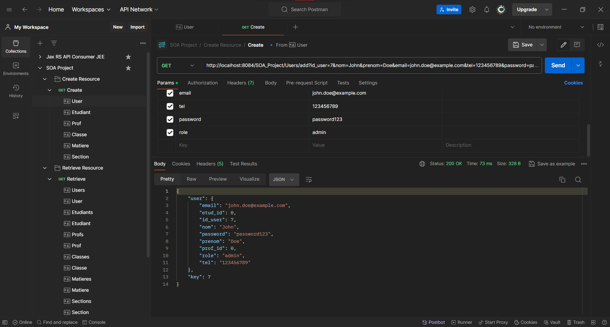
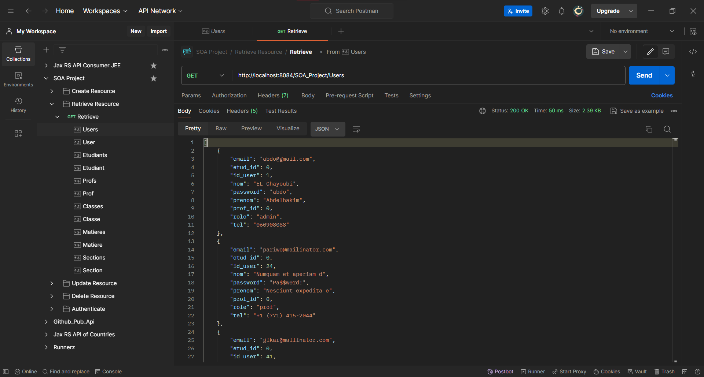
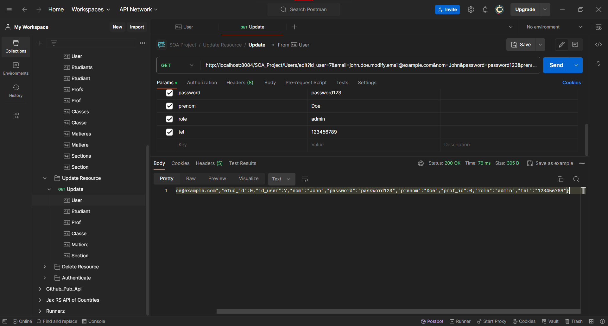
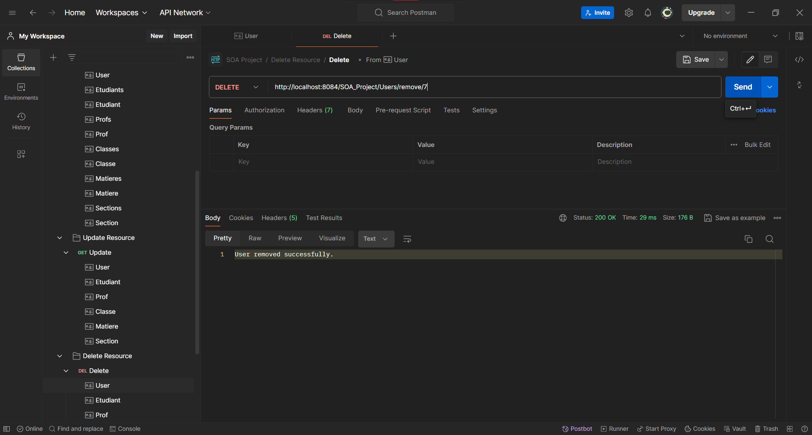

# JEE-SOA-WS-REST-Project

> *Practice Project implementing REST api in Server Side Project &amp; Consume it with Client side Project*

## API Docs

### Structure

Firstly, I have to inform you that I'm not using POST and PUT requests in my API because I had a problem where the body of the request is not working. So instead, I'm using GET and DELETE, and for POST and PUT, I'm using GET with parameters and endpoints that are clear to understand like:

- **Resource\add**: represents the creation of an element.
- **Resource\edit**: represents modifying an element.
- Here is the structure of my API URL:

    ```html
    <HTTP_Method> <Address>:<Port>/<Project_Name>/<Resource>/<[Operation]?[Parameters]>
    
    Example: 
        Client Side: GET http://localhost:8083/Jee_projet/RestReadEtudiant 
        Server Side: GET http://localhost:8083/SOA_Project/Etudiants
    ```
    
    - Where operations are: [add - edit - remove].
    - And for retrieve, I use: `<Resources>` to retrieve all and `<Resources>/id` to retrieve one element.
- For adding resources: Use a GET request with appropriate parameters to the **`/Resource/add`** endpoint.
- For editing resources: Use a GET request with appropriate parameters to the **`/Resource/edit`** endpoint.
- For removing resources: Use a DELETE request to the **`/Resource/remove`** endpoint.
- For retrieving resources: Use a GET request to the **`/Resources`** endpoint for retrieving all resources, and **`/Resources/{id}`** endpoint for retrieving a specific resource by ID.

## Issue

### Body HTTP Request

<aside>
⚠️ Sending HTTP request with body for POST & PUT always results in unsupported media type.

<br>


- I’ve tried changing the libs version.
- Activating **content-type** & **accept** with `Json`, `xml` support & it didn't work.
</aside>

## Accounts

```
# admin
abdo@gmail.com
abdo

# prof
pariwo@mailinator.com
Pa$$w0rd!

# etudiant
tiriximi@mailinator.com
Pa$$w0rd!
```

## Run Projects & Test API

- Import the SQL DB in MySQL `jeegestionprojet.sql`.
- Run the `SOA_Project` on port `8083` or change the consuming port in the Client Project `Jee_Project`.
- Run the second project.
- Import SOA `Project.postman_collection.json` & `Jax RS API Consumer JEE.postman_collection.json` to Postman.
- Start testing requests with Postman or execute directly in the browser since I don't have a request body.

### Projects Run Environment

<aside>
⚠️ JEE project is running on Apache Tomcat (2) - SOA project is running on Apache Tomcat
</aside>

### Delete API for Section & Classe

<aside>
⚠️ No need to include parameters if the element is default.
</aside>

## REST Project Structure → API / Web Service / Server side
> **Strucuture by feature**
### Models

- User - Etudiant - Prof ….

### DAO’s

- `**UserDAO**`  → talk to DB for user table
- `**EtudiantDAO`** → talk to DB for etudiant table
- …

### Service [Optional]

- `**UserService**` → logic of feature (create - read - update - delete)
- `**EtudiantService**`
- …

### Controllers

- `**FeaturesController**` → handle access to Resource [GET - POST -PUT - DELETE]
    - User
    - Etudiant
    - …

## JEE Project Structure → Consumer / Client side
> **MVC Structure**
### Servlets Old/New

### DAO’s

### Models

### Views

## Examples

### Create

### Read

### Update

### Delete
